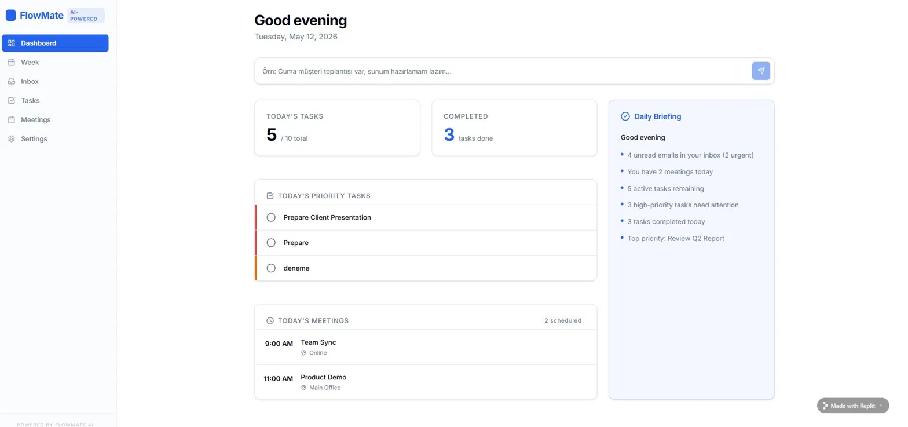
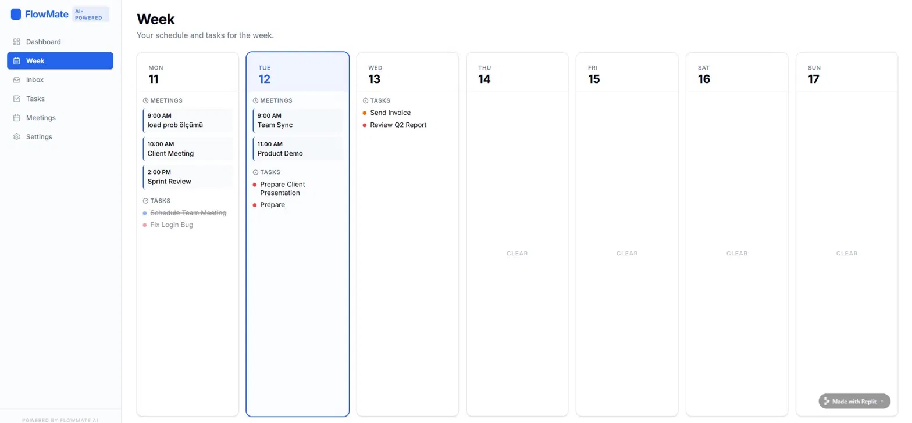
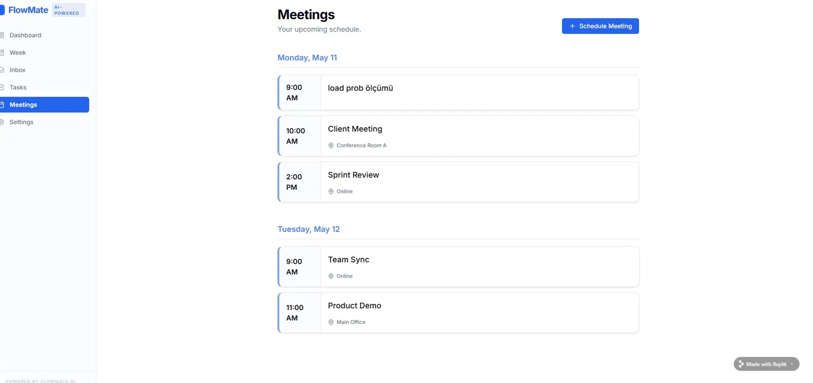
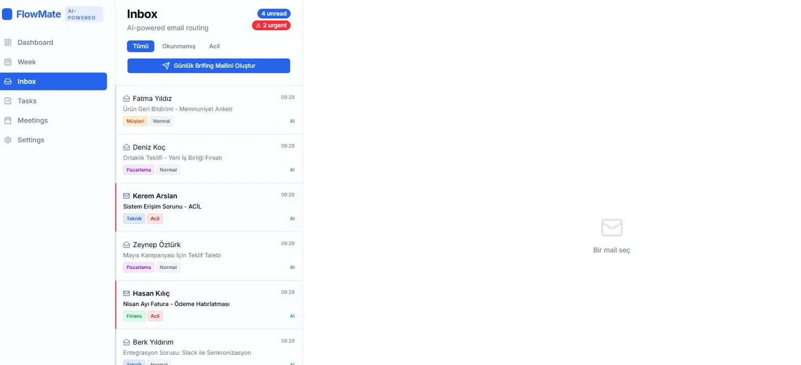
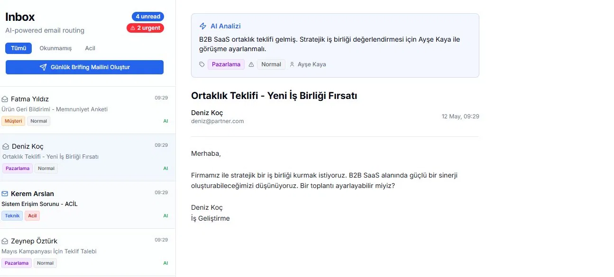
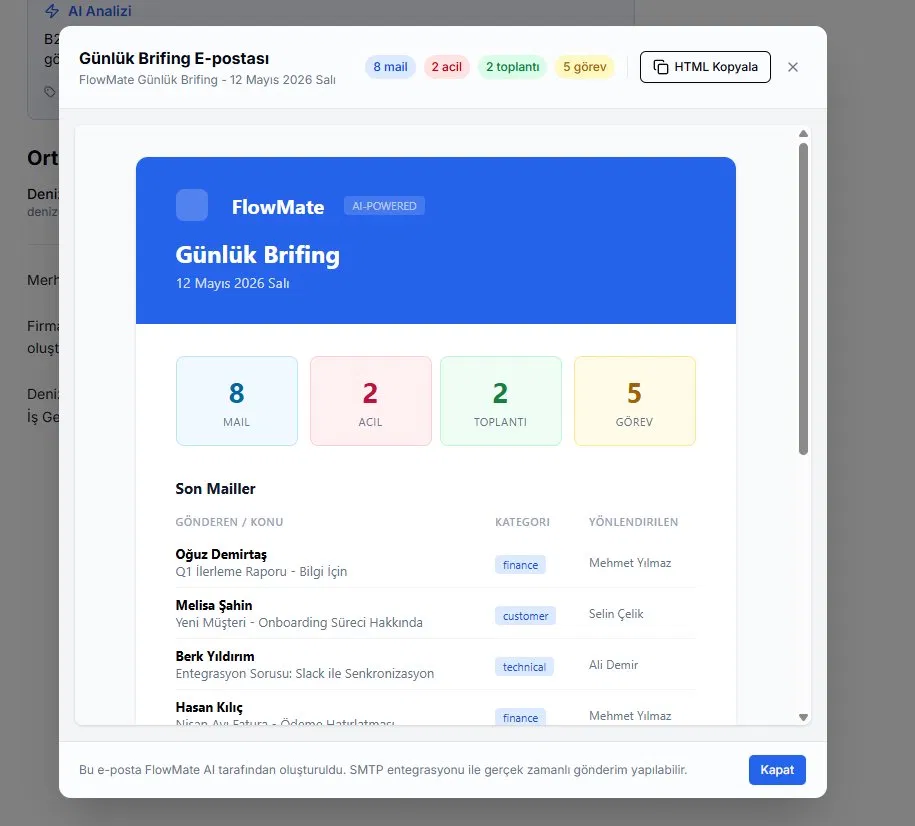
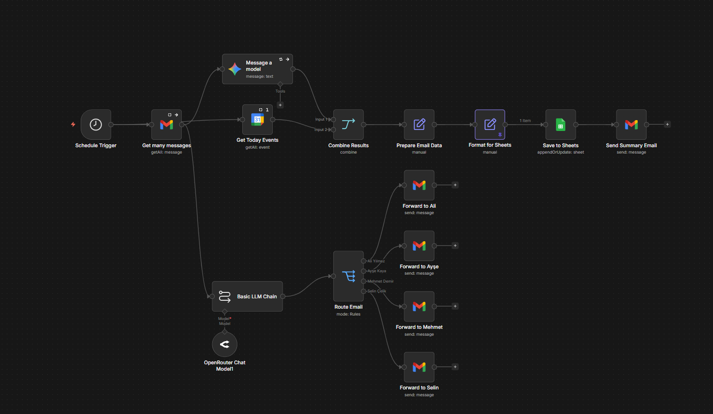

# 🤖 FlowMate — AI-Powered Daily Briefing Assistant

> **Hackathon Projesi** — "Personal AI Assistant for Daily Workflows"

Startup ekiplerinin en büyük sorunu: e-postalar, toplantılar ve görevler birbirinden bağımsız platformlarda dağınık duruyor. Ortak gelen kutusuna düşen bir mail kimi ilgilendiriyor? Kim okuyacak? Kim aksiyon alacak? Bu belirsizlik önemli işlerin gözden kaçmasına yol açıyor.

**Biz bunu çözdük.**

---

## 🔗 Canlı Demo

👉 **[FlowMate'i Dene](https://flow-mate--denemeyollari12.replit.app/)**

## 📸 Uygulamamızın Ekran Görüntüleri

### Dashboard — Günlük Özet


### Week View — Haftalık Takvim


### Meetings — Toplantı Takvimi


### Inbox — AI Destekli Mail Yönlendirme


### AI Analizi — Mail Detayı


### Günlük Brifing E-postası


## 📸 Workflow'un Ekran Görüntüsü


---

## 🎯 Proje Nedir?

FlowMate, **iki katmandan** oluşan tam entegre bir yapay zeka asistanıdır:

**🔧 Backend — n8n Otomasyon Akışı**
Her sabah 08:30'da otomatik devreye girer. Gmail, Google Calendar, Gemini AI ve Google Sheets birbirine bağlıdır.

**🖥️ Frontend — FlowMate Web Arayüzü**
Replit üzerinde geliştirilen, teknik bilgisi olmayan kullanıcıların da kolayca kullanabileceği modern web arayüzü. Dashboard, haftalık takvim, inbox, görev ve toplantı yönetimi ekranları içerir.

---

## ⚡ Özellikler

| Özellik | Açıklama |
|--------|----------|
| 🕗 **Otomatik Tetikleme** | Her sabah 08:30'da sıfır müdahaleyle başlar |
| 🧠 **AI Mail Analizi** | Gemini AI mailleri özetler, önem derecesi ve kategori belirler |
| 📬 **Akıllı Yönlendirme** | Her mail Teknik / Pazarlama / Finans / Müşteri sınıfına göre doğru kişiye iletilir |
| ⚠️ **Acil Mail Tespiti** | AI acil mailleri otomatik işaretler, kırmızı badge ile öne çıkarır |
| 📅 **Takvim Entegrasyonu** | Günlük ve haftalık toplantılar otomatik çekilir, görsel takvimde listelenir |
| 📊 **Otomatik Raporlama** | Google Sheets'e günlük log kaydedilir, geçmiş takibi yapılır |
| 📧 **Günlük Brifing** | Tek tıkla HTML formatında özet mail oluşturulur ve gönderilebilir |
| 🖥️ **Web Arayüzü** | Dashboard, Week, Inbox, Tasks, Meetings ekranlarıyla kullanıcı dostu UI |

---

## 🏗️ Mimari

```
┌─────────────────────────────────────────────┐
│           FlowMate UI (Replit)              │
│  Dashboard | Week | Inbox | Tasks | Meetings │
└──────────────────┬──────────────────────────┘
                   │
┌──────────────────▼──────────────────────────┐
│           n8n Otomasyon Akışı               │
│                                             │
│  Schedule Trigger (08:30)                   │
│         │                                   │
│         ├──► Gmail → Gemini AI Analizi      │
│         │              └──► Route Email     │
│         │                    ├── Ali        │
│         │                    ├── Ayşe       │
│         │                    ├── Mehmet     │
│         │                    └── Selin      │
│         │                                   │
│         └──► Google Calendar                │
│                    │                        │
│             Combine Results                 │
│                    │                        │
│        ┌───────────┴───────────┐            │
│   Google Sheets          Brifing Mail       │
└─────────────────────────────────────────────┘
```

---

## 👥 Ekip Yönlendirme Mantığı

AI her maili içeriğine göre analiz ederek doğru kişiye iletir:

| Kişi | Departman | Hangi Mailler? |
|------|-----------|----------------|
| **Ali** | Teknik / Developer | Teknik sorular, bug raporları, entegrasyon sorunları |
| **Ayşe** | Pazarlama | Kampanya teklifleri, iş birlikleri, ortaklık teklifleri |
| **Mehmet** | Finans | Faturalar, ödeme bildirimleri, mali raporlar |
| **Selin** | Müşteri İlişkileri | Müşteri şikayetleri, onboarding, geri bildirimler |

---

## 📬 Inbox Özellikleri

- **AI rozeti** — Her mailin köşesinde `AI` etiketi: kategori ve öncelik yapay zeka tarafından belirlendi
- **Acil / Normal badge sistemi** — Kırmızı `Acil`, gri `Normal`
- **Kategori etiketleri** — `Teknik`, `Pazarlama`, `Finans`, `Müşteri`
- **Okunmamış / Acil filtresi** — Sekme bazlı hızlı filtreleme
- **Günlük Brifing Mailini Oluştur** butonu — Tek tıkla HTML mail hazırlanır

---

## 📧 Günlük Brifing E-postası

Her brifing mailinde şunlar yer alır:

```
📊 Özet Sayaçlar
└─ 8 Mail  |  2 Acil  |  2 Toplantı  |  5 Görev

📬 Son Mailler
└─ Gönderen / Konu / Kategori / Yönlendirilen kişi

📅 Bugünkü Toplantılar
└─ Saat ve konum bilgisiyle listelenir

✅ Görev Durumu
└─ Tamamlanan ve bekleyen görevler
```

---

## 🛠️ Kullanılan Araçlar

| Araç | Kullanım Amacı |
|------|----------------|
| **[n8n](https://n8n.io/)** | Otomasyon akışları |
| **[Gemini AI](https://ai.google.dev/)** | Mail analizi, özetleme, sınıflandırma |
| **[OpenRouter](https://openrouter.ai/)** | LLM yönlendirme |
| **[Replit](https://replit.com/)** | Frontend UI geliştirme |
| **Gmail** | Mail okuma ve iletme |
| **Google Calendar** | Takvim verisi |
| **Google Sheets** | Günlük log kaydı |

---

## 🚀 Kurulum

### Backend (n8n)

1. **n8n'i kur ve başlat**
   ```bash
   npm install -g n8n
   n8n start
   ```

2. **Workflow dosyasını import et**
   - n8n arayüzünde `Import from file` seç
   - `workflow.json` dosyasını yükle

3. **Credential'ları tanımla**
   - Gmail OAuth2
   - Google Calendar OAuth2
   - Google Sheets OAuth2
   - Gemini API key
   - OpenRouter API key

4. **Ekip mail adreslerini güncelle**
   - `Route Email` node'unda kuralları kendi ekibine göre düzenle

5. **Workflow'u aktif et** — Toggle'ı aç, her sabah 08:30'da otomatik çalışır

### Frontend (FlowMate UI)

- Replit üzerinde host edilmektedir
- `.env` dosyasına API endpoint bilgilerini ekle
- `npm install && npm start` ile başlat

---

## 📁 Proje Yapısı

```
├── workflow.json              # n8n workflow export
├── README.md
└── docs/
    └── screenshots/
        ├── dashboard.png
        ├── week.png
        ├── meetings.png
        ├── inbox.png
        ├── ai-analysis.png
        └── briefing-email.png
```

---

## 🏆 Hackathon Kriterleri

| Kriter | Karşılanma Durumu |
|--------|-------------------|
| ✅ Süreç Otomasyonu | Mail takibi ve yönlendirme tamamen otomatikleştirildi |
| ✅ Yapay Zeka Kullanımı | Gemini AI özetliyor, sınıflandırıyor, önceliklendiriyor |
| ✅ Kullanıcı Deneyimi | FlowMate UI ile teknik bilgi gerektirmez |
| ✅ Entegrasyon | Gmail + Calendar + Sheets + AI = 4 platform tek akışta |
| ✅ Aksiyon Alma | Mail iletiyor, kaydediyor, brifing oluşturup gönderiyor |

---

*Bu proje "Personal AI Assistant for Daily Workflows" hackathon'u için geliştirilmiştir.*
*Powered by FlowMate AI*
